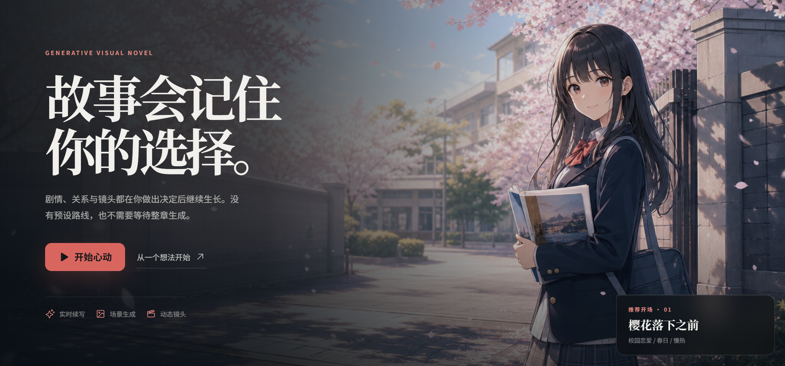
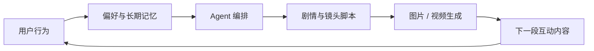
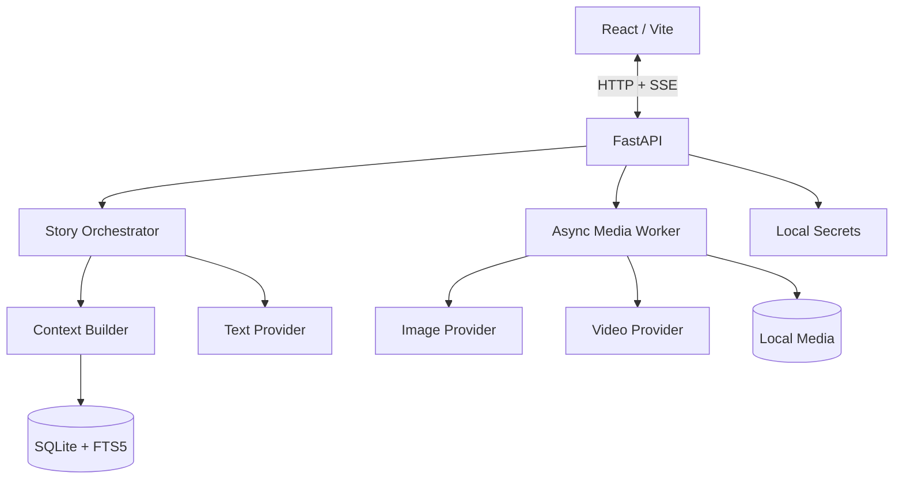

<p align="center">
  
</p>

<div align="center">

# AI Galgame

### 从“推荐下一条内容”到“生成下一条内容”

一个把 **用户选择、长期记忆、Agent 编排、图片生成与视频生成** 连接起来的开源 AI 原生互动内容引擎。

[](LICENSE)
[](https://www.python.org/)
[](https://react.dev/)
[](#当前状态)

</div>

> 传统推荐系统预测用户下一条想看什么；AI Galgame 尝试根据用户此刻的选择、长期偏好与故事上下文，实时生成下一条只属于他的内容。

## 产品概念

短视频平台的核心循环通常是：创作者生产内容，平台建立内容库，推荐算法从已有内容中选择下一条。

AI Galgame 探索另一种循环：内容不必提前存在。用户每一次选择、停留、跳过和自由输入，都可以成为下一轮生成的条件；系统持续维护人物、世界、关系和偏好，再实时生成新的剧情、画面与视频。

我们把这个方向暂称为 **SGC（System-Generated Content，系统生成内容）**。它不是一个已经统一定义的行业术语，而是这个项目对产品方向的描述：



最终目标不是做一个“会聊天的 Galgame”，而是验证一种 **生成式推荐** 的可能性：推荐对象不再是内容库里的视频 ID，而是下一段内容的主题、角色、节奏、情绪、事件和镜头。

## 它如何工作

玩家每回合可以选择系统给出的两个行动，也可以自由输入自己的行动。系统不会把输入直接当作提示词执行，而是先根据世界规则判断行动是否成立，再生成剧情结果。

```text
选择建议行动 / 输入自由行动
            ↓
Context Builder 拼装状态、记忆与用户画像
            ↓
Director / Writer 生成剧情、对白和两个新选项
            ↓
Actor / Producer 检查人物、因果、结构与安全性
            ↓
提交不可变剧情节点与权威状态快照
            ↓
生成场景图 → 以场景图为首帧生成约 6 秒视频
            ↓
播放完成或主动跳过 → 开放下一回合
```

这套循环可以用于 Galgame，也可以扩展到互动短剧、AI 陪伴、角色模拟、个性化番剧和无限连续内容。

## 核心系统

| 模块 | 作用 |
| --- | --- |
| Interaction Runtime | 提供双选项、自由输入、视频播放门控和历史回合交互 |
| Context Builder | 按预算组合世界规则、角色卡、权威状态、摘要、旧记忆和最近剧情 |
| Story Orchestrator | 编排 Director、Writer、Actor、Producer，要求模型返回可校验的结构化结果 |
| Memory System | 组合短期原文、滚动摘要、世界书、FTS5/Embeddings 检索与玩家画像 |
| Story Tree | 用不可变 Turn 构建追加式故事树，支持任意节点分叉和祖先资源共享 |
| Media Director | 把剧情结果转换为 `ImageSpec` 与 `VideoSpec`，隔离玩家输入和媒体提示词 |
| Provider Layer | 统一接入文本、图片、视频和向量模型，供应商实现可替换 |
| Media Worker | 异步提交、轮询、下载、重试和恢复图片/视频任务，并通过 SSE 推送状态 |

## 记忆不是一段无限增长的聊天记录

每次生成前，系统按固定顺序拼装上下文：

1. 世界规则、角色卡与 SFW 约束
2. 当前分支的权威 `StateSnapshot`
3. 关键词命中的世界书条目
4. 每 5 回合更新的滚动摘要
5. 最多 4 条 FTS5 / Embeddings 混排旧记忆
6. 最近 8 回合原始剧情
7. 跨分支共享、允许玩家编辑的偏好画像
8. 当前选择或自由行动

模型只提交状态增量，后端负责合并和校验。人物关系、物品、线索、未完成承诺与开放剧情线不会仅依赖模型“自己记住”。兄弟分支只能检索各自的祖先事实，玩家画像则跨分支保留。

这一设计借鉴了 SillyTavern 对不同记忆语义层的划分，但代码和数据结构为面向游戏状态的独立实现。

## 当前状态

当前版本是 **v0.1 alpha / 可运行技术 Demo**，已经完成端到端闭环：

- [x] 建立世界与最多 3 名持续角色
- [x] 每回合生成剧情、对白和恰好两个建议选项
- [x] 接受自由行动并进行剧情规则裁决
- [x] 分层长期记忆、玩家画像与上下文压缩
- [x] 场景图片生成与首帧视频生成
- [x] 视频播放完成或跳过后解锁下一回合
- [x] 任意历史节点分叉、重命名、归档与共享祖先媒体
- [x] 媒体失败重试、供应商任务 ID 持久化与重启恢复
- [x] Windows、macOS、Linux 启动脚本和 GitHub Actions

当前的“推荐”主要通过玩家画像、观看/跳过行为和上下文注入影响下一回合，还不是独立训练的召回/排序模型，也不包含在线强化学习。这正是后续要继续验证的部分。

## 快速开始

### 环境要求

- [Git](https://git-scm.com/)
- [uv](https://docs.astral.sh/uv/)
- [Node.js 20+](https://nodejs.org/)
- 一个文本模型、图片模型和视频模型 API

### Windows

```powershell
git clone https://github.com/yushui2022/AI-galgame.git
cd AI-galgame
powershell -ExecutionPolicy Bypass -File .\start.ps1
```

### macOS / Linux

```bash
git clone https://github.com/yushui2022/AI-galgame.git
cd AI-galgame
chmod +x start.sh
./start.sh
```

启动脚本会自动创建 Python 3.11 环境、安装依赖、执行数据库迁移、构建前端并打开 [http://127.0.0.1:8765](http://127.0.0.1:8765)。第一次启动按照网页向导配置模型即可。

> 本项目不附带公共 API Key 或免费额度；调用真实模型会产生供应商费用。

## 模型与 Provider

推荐的 Demo 链路是 **OpenAI-compatible LLM + 火山方舟 Seedream + 火山方舟 Seedance**。方舟图片和视频可以共用一把 API Key，但两者需要填写各自的 Model ID 或 Endpoint ID。

| 能力 | 已支持的 Provider |
| --- | --- |
| 剧情 | MiniCPM / OpenAI-compatible LLM |
| 图片 | 火山方舟 Seedream、MiniMax、OpenAI Images-compatible |
| 视频 | 火山方舟 Seedance、MiniMax Hailuo |
| 可选记忆 | OpenAI-compatible Embeddings |

方舟 Base URL：

```text
https://ark.cn-beijing.volces.com/api/v3
```

应用使用方舟 `/ping` 进行不生成媒体的凭证连通检查。图片和视频完成后会立即下载到本地，避免临时 URL 失效。模型名称、权限和价格可能变化，因此仓库不硬编码永久模型版本。

- [火山方舟图片生成 API](https://api.volcengine.com/api-docs/view?action=ImageGenerations&serviceCode=ark&version=2024-01-01)
- [火山方舟视频生成 API](https://api.volcengine.com/api-docs/view?action=CreateContentsGenerationsTasks&serviceCode=ark&version=2024-01-01)
- [MiniMax 视频生成文档](https://platform.minimaxi.com/docs/guides/video-generation)

## 技术架构



生产模式只暴露一个 FastAPI 端口并默认绑定 `127.0.0.1`。前端构建、API、媒体文件和 SSE 事件由同一进程提供；SQLite 和单进程 Worker 让 Demo 不依赖 Redis、Celery 或云端数据库。

更完整的数据结构、上下文预算、分支隔离和媒体状态机见 [架构说明](docs/ARCHITECTURE.md)。

## 项目结构

```text
AI-galgame/
├── backend/            FastAPI、SQLAlchemy、Agent、记忆与 Provider
├── frontend/           React 19、Vite、TypeScript
├── docs/               架构说明
├── .github/workflows/  CI：迁移、测试、构建与端到端流程
├── start.ps1           Windows 一键启动
└── start.sh            macOS / Linux 一键启动
```

- **Web：** React 19、TypeScript、Vite、Motion
- **API：** FastAPI、Pydantic、SQLAlchemy 2.0
- **Storage：** SQLite、FTS5、本地媒体目录
- **Realtime：** SSE + 单进程异步媒体 Worker
- **Quality：** Pytest、Ruff、Playwright、GitHub Actions

## 数据与安全

默认数据写入仓库的 `.data/`，整个目录已被 Git 忽略：

```text
.data/
├── ai-galgame.sqlite3
├── settings.local.json
└── media/
    ├── images/
    ├── videos/
    └── uploads/
```

密钥只保存在后端私密配置中，API 响应会脱敏，前端不使用 LocalStorage 保存密钥。请勿把密钥、数据库或生成媒体提交到 Git。

如果希望把持续增长的数据放到其他磁盘：

```powershell
$env:AI_GALGAME_DATA_DIR = "G:\Data\AI-galgame"
.\start.ps1
```

媒体超过 10GB 或磁盘剩余空间低于 5GB 时应用会预警，但不会自动删除文件。

## 开发与验证

```powershell
uv sync --extra dev
uv run ruff check backend
uv run pytest -q

cd frontend
npm install
npm run typecheck
npm run build
npm run test:e2e
```

测试覆盖上下文预算、状态增量、世界书、摘要、分支隔离、玩家画像、媒体引用、任务恢复和连续 30 回合模拟。端到端流程使用本地假 Provider，不消耗真实 API 额度；真实 API 冒烟测试只在本机手动运行。

## 下一步

- [ ] 把玩家画像变成显式的剧情召回与候选排序层
- [ ] 对多个候选剧情方向进行低成本预估，再生成最匹配的一条
- [ ] 加入更细的观看、跳过、重选和角色偏好反馈
- [ ] 提升多人角色跨图片、跨视频的一致性
- [ ] 支持流式剧情输出和更精确的媒体进度
- [ ] 加入 TTS、环境音、背景音乐和口型同步
- [ ] 支持存档导入导出与可分享的故事回放

暂不包含 Steam、云托管、账号、多玩家、本地视频模型、成人内容或移动端专项适配。30 回合是当前连续稳定性测试下限，不代表固定结局。

## 为什么开源

这个仓库首先是一个可拆解、可复用的实验场，适合研究：

- 推荐系统与生成模型结合后的新内容形态
- 实时生成式叙事与互动视频
- 多角色 Agent 编排与结构化状态
- 类 SillyTavern 的分层记忆在游戏运行时中的应用
- 图片到视频的异步 Provider 编排与恢复
- 从 UGC 内容消费向个性化 SGC 演进的产品可能性

如果你也在探索 AI 叙事、角色记忆、推荐算法或生成视频，欢迎提交 [Issue](https://github.com/yushui2022/AI-galgame/issues)、阅读 [贡献指南](CONTRIBUTING.md)，或实现一个新的 Provider。

## 开源、来源与致谢

本项目采用 [Apache License 2.0](LICENSE)。多 Agent 视觉小说制作角色与部分提示词组织思路受到 [AI4VisualNovel](https://github.com/ttsmallHot/AI4VisualNovel) 启发，署名说明见 [NOTICE](NOTICE)。

分层记忆为独立实现，没有复制 AGPL-3.0 的 [SillyTavern](https://github.com/SillyTavern/SillyTavern) 源码。

---

<div align="center">

如果你也相信“下一条内容可以不是被推荐出来，而是被生成出来”，欢迎点一个 Star。

</div>
