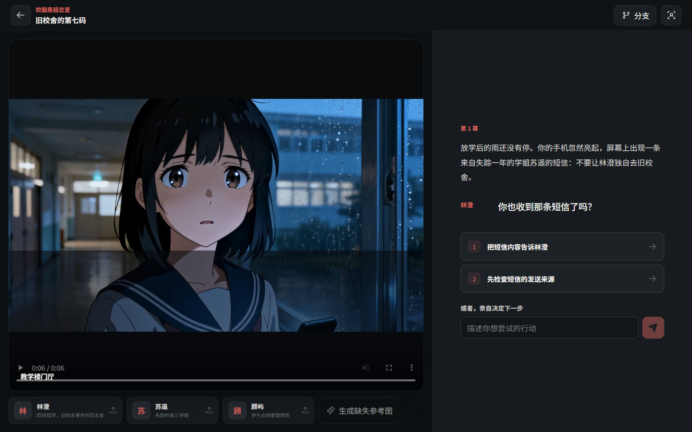
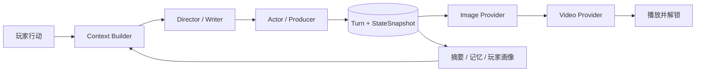

<div align="center">

# AI Galgame

### 每一次选择，都实时生成只属于你的下一幕

一个本地优先、完全开源的生成式视觉小说实验：Agent 续写剧情，长期记忆保持世界一致，Seedream 生成场景，Seedance 让画面动起来。

[](https://github.com/yushui2022/AI-galgame/actions/workflows/ci.yml)
[](LICENSE)
[](https://www.python.org/)
[](https://react.dev/)
[](#项目状态)

</div>



> 上图来自真实运行的 Demo：剧情、场景图和 6 秒视频均由模型逐回合生成，并非预制脚本或固定 CG。

## 这是什么

传统 Galgame 让玩家在预先写好的故事树中选择；AI Galgame 不预生成剧情 DAG，而是在玩家作出选择或自由输入后，结合世界状态、角色关系、长期记忆和玩家偏好，实时编排下一幕。

我们把这个方向暂称为 **SGC（System-Generated Content）**：用户不再负责生产内容，而是用自己的选择塑造内容；系统负责持续生成、记忆和演化。

```text
玩家选择 / 自由行动
        ↓
Agent 裁决并续写剧情
        ↓
Seedream 生成 16:9 场景图
        ↓
Seedance 以场景图为首帧生成 6 秒视频
        ↓
视频播放完成或跳过，进入下一回合
```

## 已经可以做什么

| 能力 | 当前实现 |
| --- | --- |
| 实时剧情 | Director / Writer 生成剧情与两个差异化选项，Actor / Producer 复核人物、因果和 SFW |
| 自由行动 | 玩家可以跳出建议选项，输入任何想尝试的行动；后端先做世界规则裁决 |
| 生成式画面 | 每回合先生成场景图，再以它为首帧生成约 6 秒视频 |
| 长期记忆 | 权威状态、世界书、滚动摘要、FTS5 旧记忆、最近 8 回合与玩家画像分层注入 |
| 故事分支 | 任意历史节点创建分支，祖先剧情和媒体共享，兄弟分支事实彼此隔离 |
| 玩家画像 | 跨分支记录题材、角色、节奏、选择与视频观看偏好，可查看、编辑和重置 |
| 任务恢复 | 媒体任务持久化、失败自动重试、供应商任务 ID 恢复轮询、SSE 实时推送 |
| 本地数据 | SQLite、密钥、图片和视频均保存在本机指定目录，不需要账号系统 |

内置“**旧校舍的第七码**”校园悬疑恋爱模板，也支持自定义世界、画风和最多 3 名持续出镜角色。

## 快速开始

### 环境要求

- [Git](https://git-scm.com/)
- [uv](https://docs.astral.sh/uv/)（负责 Python 3.11 环境与依赖）
- [Node.js 20+](https://nodejs.org/)
- 一个文本模型、图片模型和视频模型 API

### Windows

```powershell
git clone https://github.com/yushui2022/AI-galgame.git
cd AI-galgame
powershell -ExecutionPolicy Bypass -File .\start.ps1
```

### macOS / Linux

```bash
git clone https://github.com/yushui2022/AI-galgame.git
cd AI-galgame
chmod +x start.sh
./start.sh
```

启动脚本会自动创建环境、安装依赖、迁移数据库、构建前端并打开 [http://127.0.0.1:8765](http://127.0.0.1:8765)。第一次启动按照网页向导配置模型即可。

> 本项目不附带公共 API Key 或免费额度；配置真实服务会产生供应商费用。

## 模型配置

推荐的 Demo 链路是 **OpenAI-compatible LLM + 火山方舟 Seedream + 火山方舟 Seedance**。方舟图片和视频可以共用一把 API Key，但两者需要填写各自的 Model ID 或 Endpoint ID。

| 能力 | 已支持的 Provider | 配置项 |
| --- | --- | --- |
| 剧情 | MiniCPM / OpenAI-compatible | Base URL、模型名、API Key |
| 图片 | 火山方舟 Seedream | 方舟 Base URL、图片 Model/Endpoint ID、API Key |
| 图片 | MiniMax / OpenAI Images-compatible | Base URL、模型名、API Key |
| 视频 | 火山方舟 Seedance | 方舟 Base URL、视频 Model/Endpoint ID、API Key |
| 视频 | MiniMax Hailuo | Base URL、模型名、API Key |
| 可选记忆 | OpenAI-compatible Embeddings | Base URL、向量模型名、API Key |

方舟 Base URL：

```text
https://ark.cn-beijing.volces.com/api/v3
```

应用通过方舟 `/ping` 做无媒体生成的凭证连通检查。远程图片和视频成功后会立即下载到本地，避免临时 URL 失效。模型名称、权限和价格会变化，因此仓库不硬编码永久模型版本。

- [火山方舟图片生成 API](https://api.volcengine.com/api-docs/view?action=ImageGenerations&serviceCode=ark&version=2024-01-01)
- [火山方舟视频生成 API](https://api.volcengine.com/api-docs/view?action=CreateContentsGenerationsTasks&serviceCode=ark&version=2024-01-01)
- [MiniMax 视频生成文档](https://platform.minimaxi.com/docs/guides/video-generation)

## Agent 与记忆如何协作



上下文按照固定顺序构建：

1. 世界规则、角色卡与 SFW 约束
2. 当前分支的权威 `StateSnapshot`
3. 关键词命中的世界书
4. 每 5 回合更新的滚动摘要
5. 最多 4 条 FTS5 / Embeddings 混排旧记忆
6. 最近 8 回合原始剧情
7. 可编辑的玩家画像
8. 当前选择或自由行动

`Turn` 是不可变节点，模型只能提交经过白名单校验的状态增量。每回合必须推进或关闭已有线索，且最多新增一条主要线索，减少长线剧情发散。

完整数据结构、故事树隔离和媒体恢复机制见 [架构说明](docs/ARCHITECTURE.md)。

## 技术栈与目录

```text
AI-galgame/
├── backend/            FastAPI、SQLAlchemy、Agent、记忆与 Provider
├── frontend/           React 19、Vite、TypeScript
├── docs/               架构说明与展示素材
├── .github/workflows/  CI：迁移、测试、构建与端到端流程
├── start.ps1           Windows 一键启动
└── start.sh            macOS / Linux 一键启动
```

- **Web：** React 19、TypeScript、Vite、Motion
- **API：** FastAPI、Pydantic、SQLAlchemy 2.0
- **存储：** SQLite、FTS5、本地媒体目录
- **实时状态：** SSE + 单进程异步媒体 Worker
- **质量：** Pytest、Ruff、Playwright、GitHub Actions

## 数据、安全与磁盘

默认数据写入仓库的 `.data/`，整个目录已被 Git 忽略：

```text
.data/
├── ai-galgame.sqlite3
├── settings.local.json
└── media/
    ├── images/
    ├── videos/
    └── uploads/
```

密钥只保存在后端私密配置中，接口响应会脱敏，前端不使用 LocalStorage 保存密钥。请勿把密钥、数据库或真实生成媒体提交到 Git。

如果希望把持续增长的媒体放到其他磁盘：

```powershell
$env:AI_GALGAME_DATA_DIR = "G:\Data\AI-galgame"
.\start.ps1
```

媒体超过 10GB 或磁盘剩余空间低于 5GB 时应用会预警，但绝不会自动删除文件。

## 开发与验证

```powershell
uv sync --extra dev
uv run ruff check backend
uv run pytest -q

cd frontend
npm install
npm run typecheck
npm run build
npm run test:e2e
```

测试覆盖上下文预算、状态增量、世界书、摘要、分支隔离、画像、媒体引用、任务恢复和连续 30 回合模拟。端到端测试使用本地假 Provider，不消耗真实 API 额度；真实 API 冒烟测试只应在本机手动运行。

## 项目状态

当前为 **v0.1 alpha / 可运行 Demo**，已经打通：

- [x] 选项与自由输入驱动实时剧情
- [x] 分层长期记忆和玩家画像
- [x] Seedream 场景图与 Seedance 图生视频
- [x] 视频播放门控、失败重试和重启恢复
- [x] 追加式故事树与任意历史节点分叉
- [x] Windows、macOS、Linux 启动脚本与 CI
- [ ] 流式剧情输出与更细的生成进度
- [ ] 更稳定的多人角色视觉一致性
- [ ] TTS、环境音与背景音乐
- [ ] 基于玩家画像的显式剧情推荐权重
- [ ] 存档导入导出与可分享的故事回放

暂不包含 Steam、云托管、账号、多玩家、本地视频模型、成人内容或移动端专项适配。30 回合是当前连续稳定性测试下限，不代表固定结局。

## 为什么开源

这个仓库首先是一个可拆解、可复用的实验场，适合研究：

- 实时生成式叙事与 Galgame 的结合
- 多角色 Agent 编排与结构化输出
- 类 SillyTavern 的分层记忆，但面向可执行剧情状态
- 图片到视频的异步 Provider 编排与恢复
- 从 UGC 向个性化 SGC 演进的产品形态

如果你也在做 AI 叙事、角色记忆、视觉小说或生成视频，欢迎提交 [Issue](https://github.com/yushui2022/AI-galgame/issues)、[Pull Request](CONTRIBUTING.md)，或者用你的 Provider 实现一个新适配器。

## 开源、来源与致谢

本项目采用 [Apache License 2.0](LICENSE)。多 Agent 视觉小说制作角色与部分提示词组织思路受到 [AI4VisualNovel](https://github.com/ttsmallHot/AI4VisualNovel) 启发，署名说明见 [NOTICE](NOTICE)。

分层记忆为独立实现，没有复制 AGPL-3.0 的 [SillyTavern](https://github.com/SillyTavern/SillyTavern) 源码。

---

<div align="center">

如果这个方向让你觉得“下一代互动内容可能就该这样”，欢迎点一个 Star。

</div>
