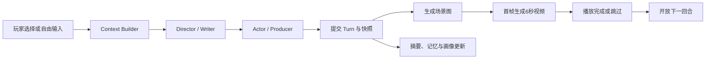

# AI Galgame

一个本地优先、边玩边生成图片与短视频的中文 Web Galgame。玩家可以选择模型给出的两个行动，也可以自由输入尝试；系统会维护权威剧情状态、长期记忆、故事分支和玩家偏好，再把每回合编排成场景图与约6秒的视频镜头。

当前版本是 `v0.1 alpha`。仓库使用 Apache-2.0，适合研究、二次开发和制作演示。

## 已实现

- React + TypeScript 的中文游戏界面，FastAPI 统一托管生产构建
- MiniCPM 与其他 OpenAI-compatible LLM
- 火山方舟 Seedream、MiniMax 与 OpenAI Images-compatible 图片接口
- 火山方舟 Seedance 与 MiniMax Hailuo 图生视频任务
- SQLite FTS5、滚动摘要、世界书、最近剧情和可选 Embeddings 混排
- 不可变回合节点、任意历史节点分叉、分支重命名、归档、恢复与显式清理
- 可编辑玩家画像，画像跨分支共享，剧情事实按祖先链隔离
- 图片先展示、视频后替换；播放完或主动跳过后开放下一回合
- 持久化媒体任务、自动重试、供应商任务 ID 恢复轮询和 SSE 实时状态
- “旧校舍的第七码”校园悬疑恋爱模板与自由创建入口
- Windows、macOS 和 Linux 启动脚本

## 快速开始

需要安装：

- [uv](https://docs.astral.sh/uv/)
- Node.js 20 或更高版本
- Git

Windows：

```powershell
git clone git@github.com:yushui2022/AI-galgame.git
cd AI-galgame
Set-ExecutionPolicy -Scope Process Bypass
.\start.ps1
```

macOS / Linux：

```bash
git clone git@github.com:yushui2022/AI-galgame.git
cd AI-galgame
chmod +x start.sh
./start.sh
```

脚本会检查工具、创建 Python 3.11 环境、安装依赖、执行数据库迁移、构建前端并启动 `http://127.0.0.1:8765`。首次启动会进入供应商设置向导。

### 把媒体放到其他磁盘

默认数据在仓库的 `.data`，也可以在启动前设置绝对路径。数据库、密钥配置和所有媒体会一起写入该目录。

```powershell
$env:AI_GALGAME_DATA_DIR = "G:\Data\AI-galgame"
.\start.ps1
```

仓库不会硬编码磁盘路径，也不会自动删除媒体。媒体超过10GB或磁盘剩余空间低于5GB时，后端会返回预警状态。

## 供应商配置

| 能力 | 适配器 | 需要填写 |
| --- | --- | --- |
| 剧情 | MiniCPM / OpenAI-compatible | API 地址、模型名、API Key |
| 图片 | 火山方舟 Seedream | `https://ark.cn-beijing.volces.com/api/v3`、图片模型或 Endpoint ID、API Key |
| 图片 | MiniMax Image | `https://api.minimax.cn`、当前可用模型名、API Key |
| 图片 | OpenAI Images-compatible | API 地址、模型名、API Key |
| 视频 | 火山方舟 Seedance | `https://ark.cn-beijing.volces.com/api/v3`、视频模型或 Endpoint ID、API Key |
| 视频 | MiniMax Hailuo | `https://api.minimax.cn`、当前可用模型名、API Key |
| 可选记忆 | OpenAI-compatible Embeddings | API 地址、向量模型名、API Key |

模型名称和服务价格会变化，因此模型名只保存在本地配置中，不作为永久默认值写死。方舟图片和视频可共用同一 API Key，但模型 ID 需要分别填写；远程媒体生成后会立即下载到本地。可参考 [火山方舟图片生成文档](https://api.volcengine.com/api-docs/view?action=ImageGenerations&serviceCode=ark&version=2024-01-01)、[火山方舟视频生成文档](https://api.volcengine.com/api-docs/view?action=CreateContentsGenerationsTasks&serviceCode=ark&version=2024-01-01) 与 [MiniMax 视频生成文档](https://platform.minimaxi.com/docs/guides/video-generation)。

密钥只写入 `AI_GALGAME_DATA_DIR/settings.local.json`。接口响应会脱敏，前端不使用 LocalStorage 保存密钥，日志也不输出配置对象。

## 一回合如何生成



自由输入只被当作“玩家尝试采取的行动”，不会直接成为系统指令或媒体提示词。Agent 编排、内部提示词和记忆候选只记录在后端诊断链路中，不在玩家界面显示。

更完整的数据结构、上下文顺序和任务恢复方式见 [架构说明](docs/ARCHITECTURE.md)。

## 开发与测试

```powershell
uv sync --extra dev
uv run ruff check backend
uv run pytest -q

cd frontend
npm install
npm run typecheck
npm run build
npm run test:e2e
```

浏览器测试使用本地假 LLM、图片和视频供应商，不会消耗真实 API 额度。真实供应商冒烟测试应在本机手动进行，不要把密钥、生成媒体或私密配置提交到 Git。

当前自动测试包括：

- 状态增量、线索数量、摘要更新和结构校验
- 祖先链记忆隔离、FTS5 检索和公共媒体共享
- 30回合连续续写并每5回合创建分支
- 视频任务 ID 的重启恢复
- 归档分支的孤儿媒体清理
- 设置、创建、建议选项、自由输入、媒体解锁、分叉、画像和刷新恢复的 Playwright 流程

## v0.1 边界

暂不包含 Steam、账号、云托管、多人、本地视频模型、ComfyUI、TTS、背景音乐、成人内容、移动端专项适配或预生成剧情 DAG。30回合是连续稳定性测试下限，不是固定结局。

## 开源与署名

本项目采用 [Apache License 2.0](LICENSE)。多 Agent 视觉小说制作角色与部分提示词组织思路受到 [AI4VisualNovel](https://github.com/ttsmallHot/AI4VisualNovel) 启发，具体说明见 [NOTICE](NOTICE)。

分层记忆为独立实现，没有复制 AGPL-3.0 的 SillyTavern 源码。
