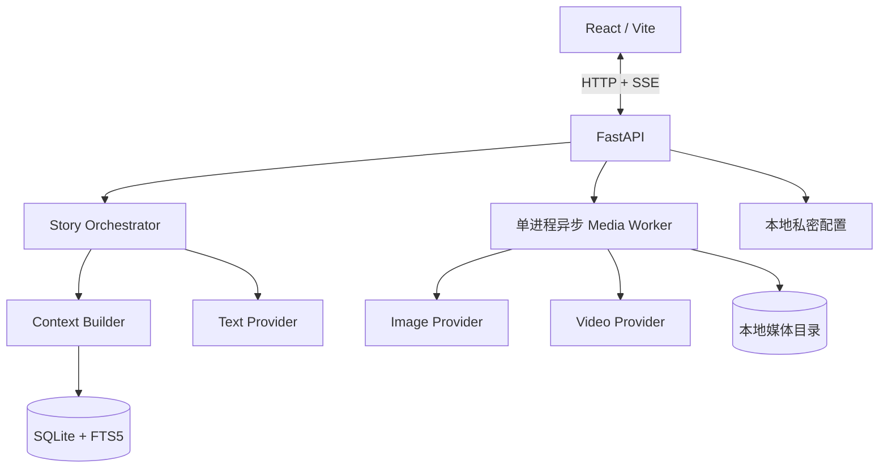

# 架构说明

## 组件



生产模式只暴露 FastAPI 端口。`frontend/dist`、`/api`、`/media` 和 SSE 都由同一进程提供，默认绑定 `127.0.0.1`。

## 故事树

- `Turn` 是不可变剧情节点，通过 `parent_turn_id` 形成追加式树。
- `Branch` 只保存名称、归档状态和当前头节点。
- 分叉不会复制祖先回合、状态快照或媒体。
- 上下文检索只允许使用当前头节点的祖先集合，因此兄弟分支事实不会串线。
- 玩家画像属于本地玩家，不绑定分支。
- 永久清理只能作用于已归档分支，并且只删除不再被其他分支祖先链引用的后缀回合与媒体。

## 权威状态

每个回合指向一个 `StateSnapshot`，包含：

- 地点与时间
- 角色状态与关系值
- 线索、物品和世界标记
- 未完成承诺
- 开放剧情线索及其进度

模型只返回 `state_delta`。后端仅接受白名单字段，并独立应用线索更新。单回合最多打开一条主要线索，已有线索可以推进或关闭。

## 上下文拼装

固定顺序为：

1. 世界规则、角色卡与 SFW 约束
2. 当前分支权威状态
3. 关键词命中的世界书
4. 每5个祖先节点更新的滚动摘要
5. 最多4条 FTS5 或 Embeddings 混排记忆
6. 最近8个祖先回合
7. 玩家画像
8. 当前行动

上下文会对单项长度和总字符量做预算。Embeddings 未配置或请求失败时自动回退到 FTS5，不影响继续游玩。

## Agent 编排

Director / Writer 首先裁决玩家行动并生成结构化 `TurnResult`。Pydantic 校验失败时携带错误自动重试两次。随后 Actor / Producer 做人物口吻、因果、选项差异、线索推进和 SFW 复核。复核失败时保留已通过结构校验的初稿。

结构校验通过之后才会提交 Turn 和 StateSnapshot，因此 LLM 失败不会留下半个剧情节点。

## 媒体状态机

```text
queued
  -> generating_image
  -> generating_video
  -> ready
  -> unlocked (播放完成或跳过)
```

图片生成成功后立刻下载到本地并通过 SSE 通知前端。视频以图片的远程结果作为首帧提交，成功后同样立即下载。

`GenerationJob` 保存阶段、供应商任务 ID、供应商进度、重试次数和错误。应用重启时：

- 尚未提交图片的任务重新排队；
- 已有图片和视频任务 ID 的任务复用本地首帧并继续轮询；
- 明确失败的供应商任务会清除旧 ID，用更保守的 SFW 提示重新提交；
- 自动尝试共3次，之后由玩家重试、切换全局供应商或跳过。

跳过只解锁下一回合，不回滚已经提交的剧情。解锁接口是幂等的，不会因重复事件重复累计观看次数。

## 数据目录

```text
AI_GALGAME_DATA_DIR/
├── ai-galgame.sqlite3
├── settings.local.json
└── media/
    ├── images/
    ├── videos/
    └── uploads/
```

远程媒体按 SHA-256 内容哈希命名。Git 忽略整个数据目录，应用不执行自动清理。

## Provider 契约

```text
TextProvider.generate_structured(system_prompt, user_prompt, schema)
ImageProvider.submit(ImageSpec) -> ProviderJob
ImageProvider.poll(ProviderJob) -> ProviderJob
VideoProvider.submit(VideoSpec) -> ProviderJob
VideoProvider.poll(ProviderJob) -> ProviderJob
EmbeddingProvider.embed(texts) -> vectors
```

模型名称、基础 URL 和密钥均来自本地配置。适配器不把供应商特有字段泄漏到故事编排层。
